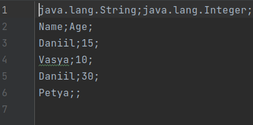
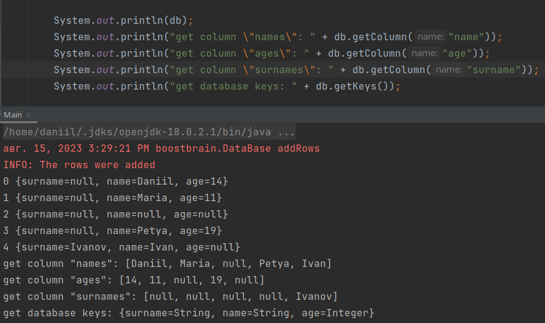
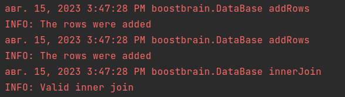
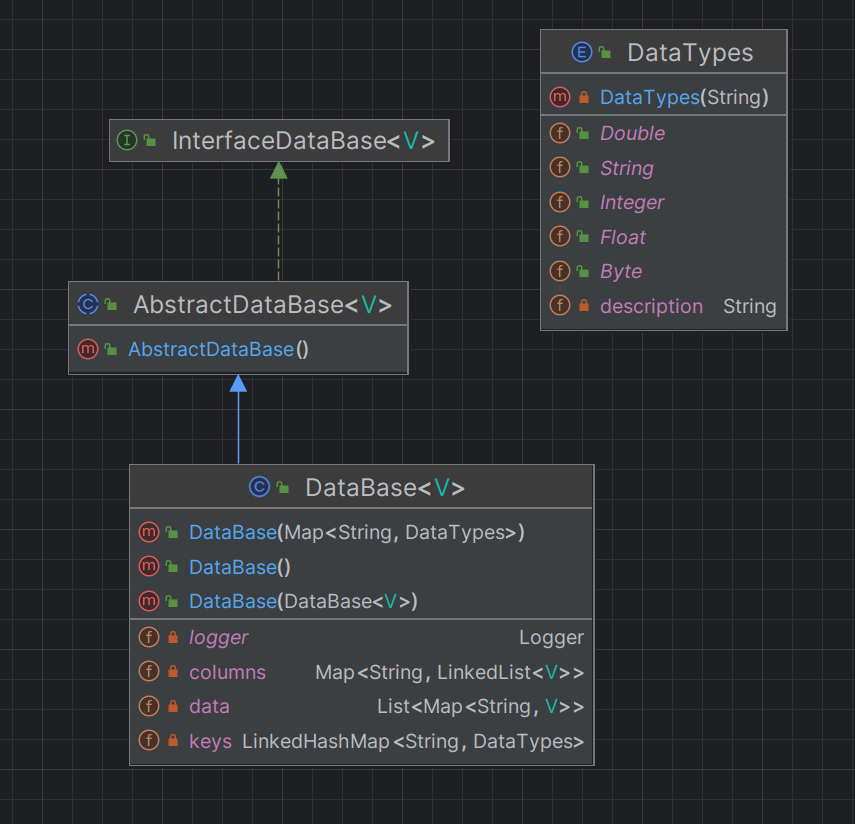
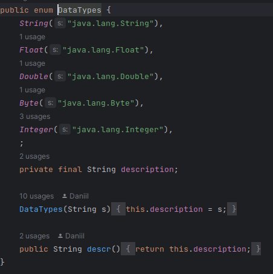

# База данных

Даллее будут перечислены основные функции по работе и созданию базы данных

### Чтение из файла
Файл должен иметь следующую структуру:


В первой строчке должны быть прописаны через ```;``` типы соответствующих колонок. 
Могут быть указаны только типы из ```enum DataTypes```(об этом ниже)

Во второй строчке должны быть прописаны названия колонок через ```;```

В следующих строчках должны идти значения через ```;```. 
Если значения у какой-либо колонки отсутствует(напрмиер 6
строчка), то записываем как ```null``` в таблицу


### Запись в файл

Метод ```writeToFile``` записывает БД в текстовый файл


### Вывод столбца, ключей бд и самой бд

Метод ```getColumn``` возвращает список значений из заданного столбца


### Добавление значений бд

Метод ```addToDatabase``` добавляет строку в БД. Можно указать позицию добавления


### Вывод строки по индексу

Метод ```getRow(Integer i)``` возвращает строку по заданному индексу

### Джойн по столбцам

Статический метод ```DataBase.innerJoin(DataBase<T> db1, DataBase<V> db2, String[] keys)``` возвращает БД, полученное после джойна


### Логгирование

В случае ошибок логи выводятся в консоль. Примеры логгов:


### Структура проекта




##### ```DataTypes``` определяет какие типы можно считывать из файла



